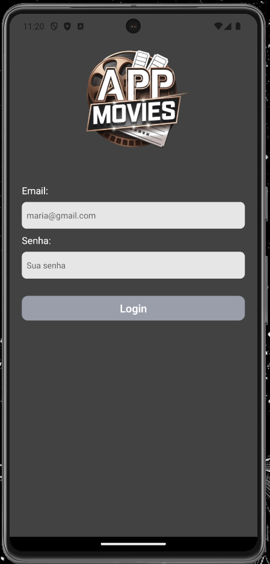
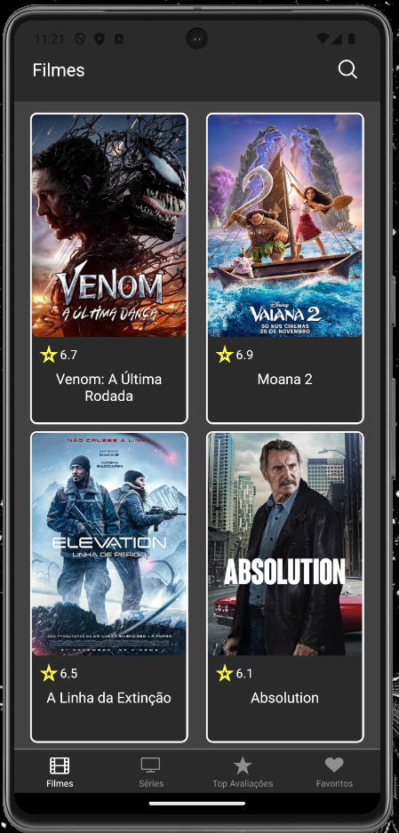
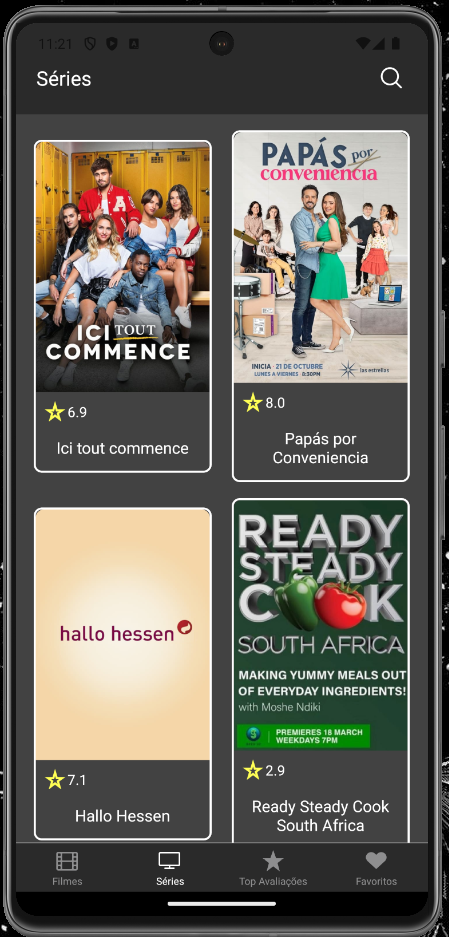
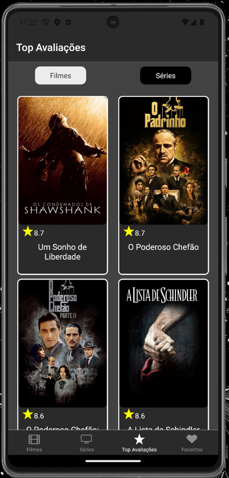
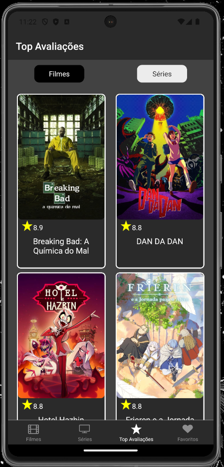
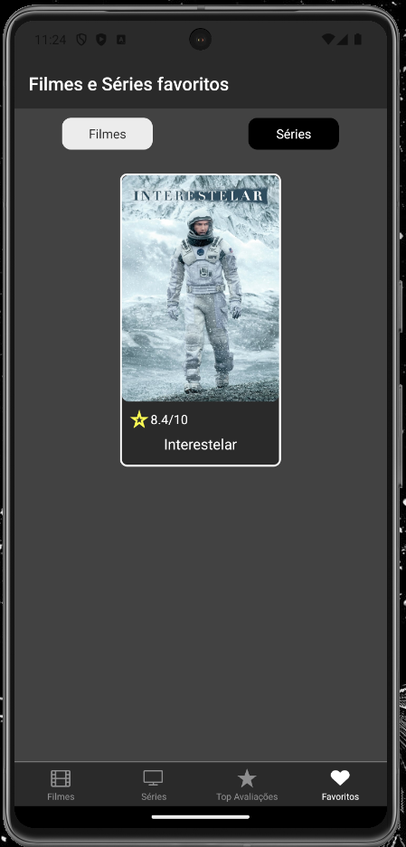
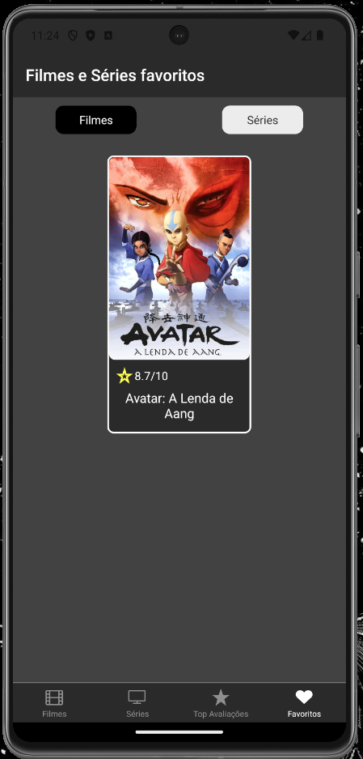
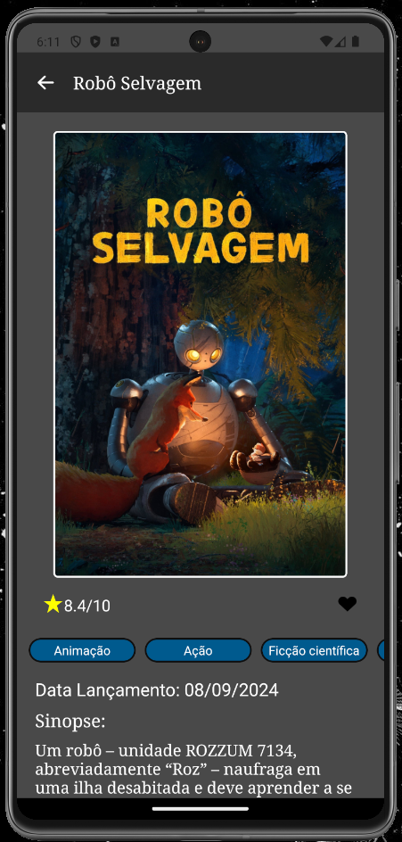

<h1 align='center'>APP Movies</h1>

<h4>Glossário</h4>

- O que é esse projeto? E o que é possivel fazer?
- Tecnologias Utilizadas
- Como rodar os testes?
- App em Funcionamento

## O que é esse projeto? E o que é possivel fazer?

**O APP Movies tem como objetivo listar os Filmes e Séries e algumas funcionalidades.**

#### Com o app é possivel:

<details>

#### Tela de Filmes:
- Visualizar os filmes em lançamentos.
- Procurar filmes de barra de busca.
- Clicar no card do filme e visualizar os seus detalhes.

#### Tela de Séries:
- Visualizar os séries em lançamentos.
- Procurar séries de barra de busca.
- Clicar no card do série e visualizar os seus detalhes.

#### Tela de Top Avaliações:
- Visualizar os Filmes e Séries com as melhores avaliações.
- Clicar no card do série e visualizar os seus detalhes.

#### Tela de Favoritos:
- Visualizar os Filmes e Séries marcados pelo usuário como um dos seus favoritos.
- Clicar no card e remover da sua lista.

</details>

## Tecnologias Utilizadas

<div align="center">


</div>

## Como rodar os testes?

<h5>Para rodar os testes basta utilizar esse comando:</h5>

#### OBS: Os testes realizados neste projeto são feitos utilizando o [Maestro](https://maestro.mobile.dev/platform-support/react-native). Por isso, é necessário interceptar as requisições que o app realiza. Caso você queira visualizar os testes, uma das opções é utilizar o WireMock.

```bash
docker run -d --name wiremock -p 8080:8080 -v $(pwd)/apiMock/mockJson:/home/wiremock wiremock/wiremock
```

#### Com o comando acima você irá conseguir interceptar as requisições. É necessário ter o `docker` na sua máquina.

```bash
$ npm test
```

## Telas do APP

<div style="display:flex; flex-wrap: wrap; text-align: center; justify-content: center; align-itens: center">
  <div style="margin: 2%">
    <h4>Tela de Login</h4>
    
  </div>
  <div style="margin: 2%">
    <h4>Tela de Filmes</h4>
    
  </div>
  <div style="margin: 2%">
    <h4>Tela de Séries</h4>
    
  </div>
  <div style="margin: 2%">
    <h4>Tela de Melhores Filmes</h4>
    
  </div>
  <div style="margin: 2%">
    <h4>Tela de Melhores Séries</h4>
    
  </div>
  <div style="margin: 2%">
    <h4>Tela de Filmes Favoritos</h4>
    
  </div>
  <div style="margin: 2%">
    <h4>Tela de Séries Favoritas</h4>
    
  </div>
  <div style="margin: 2%">
    <h4>Tela de Detalhes</h4>
    
  </div>
</div>
